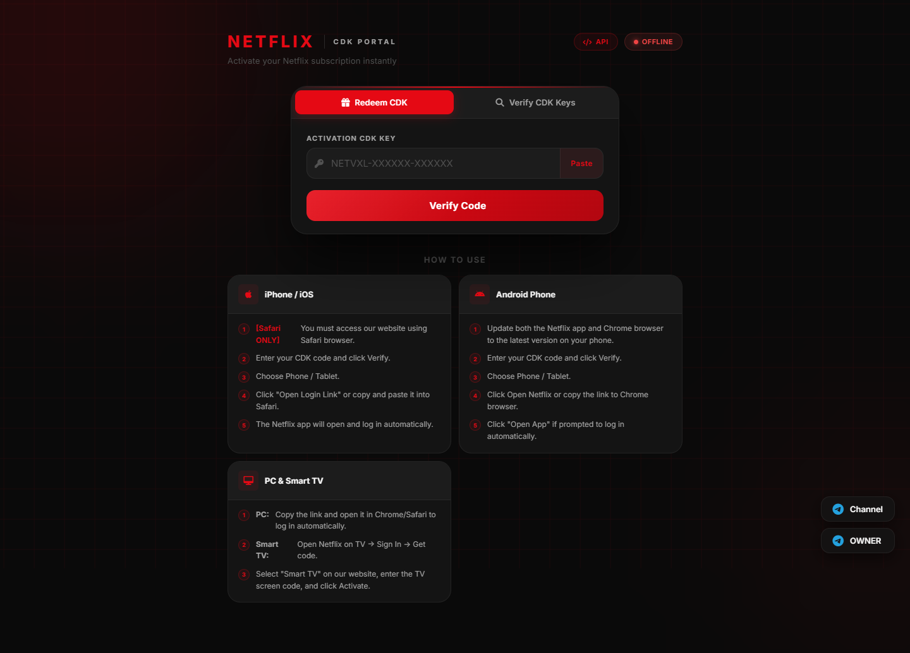

# Netflix CDK Portal & Telegram Management Bot

A full-stack CDK redemption portal and Telegram bot automation system built with Node.js, Express, and SQLite. The platform provides a web-based key redemption workflow with multi-device support, combined with an administrative Telegram bot for code generation, channel verification, and customer lifecycle management.



---

## Overview

This project provides an automated workflow for managing, distributing, and redeeming access keys (CDKs). Users receive license keys through a Telegram bot or distribution campaigns, which can then be validated and redeemed via a responsive web portal optimized for mobile, desktop, and Smart TV browsers.

---

## Architecture

The system is split into two runtime components:
1. **Web Portal & API Server (`server.js`)**: An Express.js application serving the frontend redemption interface and securing API endpoints with rate limiting and encrypted session tokens.
2. **Telegram Bot (`bot.js`)**: An administrative and client-facing bot facilitating key generation, membership checks, referral rewards, and user support.

### Project Structure

```text
├── assets/
│   └── portal_preview.png       # Portal UI preview screenshot
├── public/
│   ├── index.html               # Customer-facing redemption portal
│   ├── adm_sys_78f9a2.html      # Administrative dashboard
│   ├── js/                      # Frontend client scripts
│   └── css/                     # Interface stylesheet
├── bot.js                       # Telegram bot implementation
├── server.js                    # Express web server and REST API
├── db.js                        # SQLite database interface
├── cookieStore.js               # Account pool and session store
├── proxy.js                     # Outbound proxy routing (HTTP/SOCKS)
├── lang.js                      # Multi-language localization dictionary
├── customEmoji.js               # Telegram UI typography formatting
├── package.json                 # Dependency definitions
├── .env.example                 # Environment variables template
└── .gitignore                   # Exclusions for private credentials
```

---

## Features

- **CDK Generation & Validation**: Issues structured keys (`NETVXL-XXXXXX-XXXXXX`) tied to specific durations (7 days, 1 month, 3 months, 6 months, 1 year).
- **Responsive Web Portal**: Fast, lightweight UI featuring key verification, activation status, and step-by-step device onboarding instructions.
- **Device Support Guidance**: Built-in instructions tailored for iOS/Safari, Android, Desktop browsers, and Smart TVs.
- **Telegram Bot Automation**:
  - Automatic channel subscription verification before issuing keys.
  - Referral program tracking with customizable bonus logic.
  - Multi-language support (English, Arabic, French, and more).
- **Security & Hardening**:
  - In-memory rate limiting on redemption endpoints to prevent brute-force attacks.
  - Strict separation of credentials via environment variables.
  - Exclusions configured to prevent committing session data or databases.

---

## Prerequisites

- Node.js (version 18.0.0 or higher recommended)
- npm (Node Package Manager)
- A Telegram Bot Token from [@BotFather](https://t.me/BotFather)

---

## Installation & Setup

### 1. Clone the Repository

```bash
git clone https://github.com/hamzavxl/netflix.git
cd netflix
```

### 2. Install Dependencies

```bash
npm install
```

### 3. Configure Environment Variables

Copy the example configuration file and enter your credentials:

```bash
cp .env.example .env
```

Edit `.env` with your preferred text editor:

```env
TELEGRAM_BOT_TOKEN=your_bot_token_from_botfather
ADMIN_CHAT_ID=your_numeric_telegram_user_id
PORT=7677
```

### 4. Run the Application Locally

Start the web portal server:

```bash
npm run start
```
The portal will be accessible at `http://localhost:7677`.

In a separate terminal, launch the Telegram bot:

```bash
npm run bot
```

---

## Production Deployment (VPS)

For high-availability production deployment on Ubuntu/Debian using PM2 and Nginx:

### 1. Process Management with PM2

```bash
npm install -g pm2
pm2 start server.js --name "netflix-server"
pm2 start bot.js --name "netflix-bot"
pm2 save
pm2 startup
```

### 2. Nginx Reverse Proxy Configuration

Create an Nginx configuration file for your domain (e.g., `/etc/nginx/sites-available/netvxl`):

```nginx
server {
    server_name yourdomain.com;

    location / {
        proxy_pass http://127.0.0.1:7677;
        proxy_http_version 1.1;
        proxy_set_header Upgrade $http_upgrade;
        proxy_set_header Connection 'upgrade';
        proxy_set_header Host $host;
        proxy_set_header X-Real-IP $remote_addr;
        proxy_set_header X-Forwarded-For $proxy_add_x_forwarded_for;
        proxy_set_header X-Forwarded-Proto $scheme;
        proxy_cache_bypass $http_upgrade;
    }
}
```

Enable the site and obtain an SSL certificate:

```bash
sudo ln -s /etc/nginx/sites-available/netvxl /etc/nginx/sites-enabled/
sudo nginx -t
sudo systemctl reload nginx
sudo certbot --nginx -d yourdomain.com
```

---

## Security Guidelines

- Never commit the `.env` file or SQLite database files (`database.sqlite`) to version control.
- Keep session files and sensitive tokens restricted to secure server environments with strict file permissions (`chmod 600`).
- Ensure all admin dashboard URLs use strong authentication headers.

---

## Contact & Community

- Developer: [@V_X_L1](https://t.me/V_X_L1)
- Telegram Channel: [@VXL_STORE_V1](https://t.me/VXL_STORE_V1)


---

## License

This project is licensed under the MIT License. See the [LICENSE](LICENSE) file for details.

